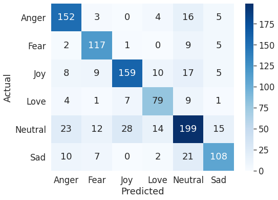
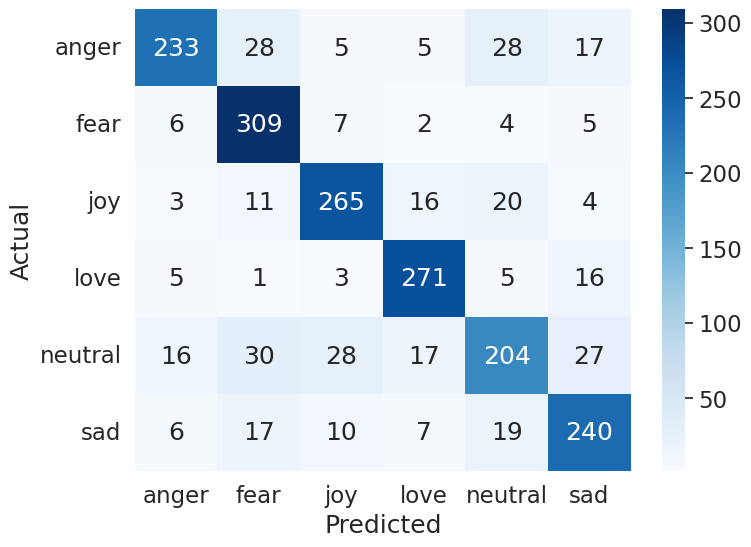
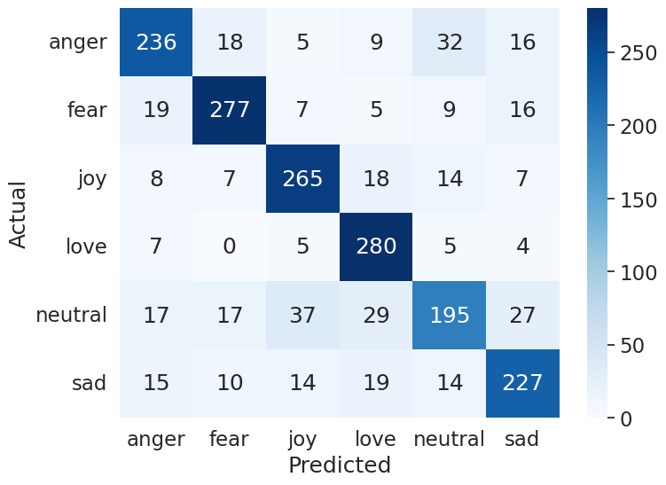
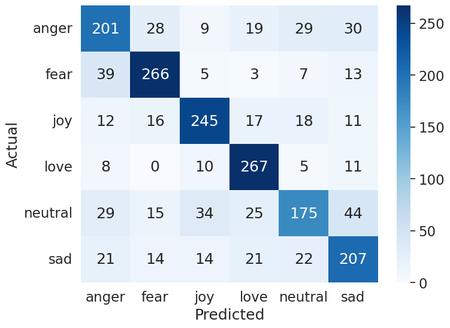

# Ringkasan Proyek: Emotion Classification with PEFT (Augmented, bf16)

## Informasi Umum

| Aspek | Detail |
|---|---|
| **Judul Penelitian** | LLM-Based Augmentation for Classification Emotion on Data Imbalaced |
| **Tujuan** | Klasifikasi emosi pada teks tweet berbahasa Indonesia menggunakan PEFT + LoRA secara efisien.
||Melakukan penyeimbangan dataset dan fine-tuning model menggunakan PEFT LoRA. |

---

## Komputasi & Infrastruktur

| Tahap | GPU | Memori | 
|-------|-----|--------|
| Augmentasi | NVIDIA A100 | 40 GB |
| HP Tuning | NVIDIA A100 | 40 GB |
| Fine-Tuning | NVIDIA A100 | 40 GB |

---
## Dataset

### Sumber
- **Dataset:** "Emotion Dataset from Indonesian Public Opinion" oleh Riccosan et al. (2022)
- **Repo:** [github.com/Ricco48/Emotion-Dataset-from-Indonesian-Public-Opinion](https://github.com/Ricco48/Emotion-Dataset-from-Indonesian-Public-Opinion)
- **Jumlah awal:** 7.080 tweet berbahasa Indonesia
- **6 label emosi:** `joy`, `sad`, `anger`, `fear`, `love`, `neutral`

### Distribusi Sebelum Augmentasi

| Label   | Jumlah |
|---------|--------|
| joy     | 1.275  |
| sad     | 1.003  |
| anger   | 1.130  |
| fear    | 911    |
| love    | 760    |
| neutral | 2.001  |
| **Total** | **7.080** |

### Augmentasi Data

**Notebook:** `Augmentasi_indonesia_Tweet_Model_Base_bnf16.ipynb`

Data tidak seimbang (imbalanced) diseimbangkan menjadi **2.100 sampel per kelas** menggunakan augmentasi berbasis **Llama 3 8B**.

| Aspek | Detail |
|---|---|
| **Model augmentasi** | `meta-llama/Meta-Llama-3-8B` |
| **GPU** | NVIDIA A100 40GB |
| **Metode** | Few-shot paraphrasing dengan preservasi emosi |
| **Prompt** | Bahasa Indonesia, 3 contoh few-shot (joy, sad, anger) |
| **Parameter generasi** | `temperature=0.7`, `top_p=0.9`, `max_new_tokens=128`, `batch_size=32` |
| **Maksimal retry** | 4 kali per teks |

### Validasi Teks Hasil Augmentasi
- Minimal 5 kata per teks
- Deteksi duplikat eksak terhadap teks yang sudah ada
- **Jaccard similarity < 0.85** terhadap teks asli (mencegah near-duplicate)
- Pembersihan artifact prompt (token spesial Llama, tanda kutip, frasa artifak)
- Hanya mengambil baris pertama non-kosong dari output

### Hasil Augmentasi

| Label   | Data Asli | Data Baru | Total |
|---------|-----------|-----------|-------|
| joy     | 1.275     | +825      | 2.100 |
| sad     | 1.003     | +1.097    | 2.100 |
| anger   | 1.130     | +970      | 2.100 |
| fear    | 911       | +1.189    | 2.100 |
| love    | 760       | +1.340    | 2.100 |
| neutral | 2.001     | +99       | 2.100 |
| **Total** | **7.080** | **5.520** | **12.600** |

### Split Data

**Notebook:** `split_data.ipynb`

Menggunakan **two-stage holdout split** (`sklearn.model_selection.train_test_split`, `random_state=42`):

| Split | Proporsi | Jumlah |
|-------|----------|--------|
| Train | 70%      | 8.820  |
| Val   | 15%      | 1.890  |
| Test  | 15%      | 1.890  |
| **Total** | **100%** | **12.600** |

---

## Metodologi: PEFT + LoRA

### Konsep
**Parameter-Efficient Fine-Tuning (PEFT)** dengan **Low-Rank Adaptation (LoRA)** melatih hanya sejumlah kecil parameter tambahan (adapter) alih-alih seluruh parameter model. Matriks bobot pre-trained didekomposisi menjadi matriks low-rank yang efisien.

### Konfigurasi LoRA (Identik untuk Semua Model)

| Parameter | Nilai |
|---|---|
| `peft_type` | LORA |
| `task_type` | SEQ_CLS |
| `r` (rank) | 8 |
| `lora_alpha` | 32 |
| `lora_dropout` | 0.1 |
| `target_modules` | `query`, `value` |
| `bias` | none |
| `inference_mode` | true |

### Tokenisasi
- `max_length`: 128 token
- `truncation`: True
- `padding`: max_length

---

## Empat Model Pre-trained

| # | Model | HuggingFace ID | 
|---|-------|---------------|
| 1 | **IndoBERTweet** | `indolem/indobertweet-base-uncased` |
| 2 | **mBERT** | `google-bert/bert-base-multilingual-cased` | 
| 3 | **XLM-RoBERTa Base** | `FacebookAI/xlm-roberta-base` |
| 4 | **XLM-RoBERTa Large** | `FacebookAI/xlm-roberta-large` |

---

## Hyperparameter Tuning

**Script:** `hp_tuning_peft.py`  
**Shell:** `run_hp_tuning_peft.sh`  
**Library:** Optuna  
**Jumlah trials per model:** 10  
**Objective:** Minimalkan `training_loss`

### Search Space

| Hyperparameter | Tipe | Range / Nilai |
|---|---|---|
| `num_train_epochs` | int | 1 – 10 |
| `learning_rate` | categorical | [1e-4, 3e-4, 2e-5, 3e-5, 5e-5] |
| `per_device_train_batch_size` | categorical | [8, 16, 32, 64] |
| `per_device_eval_batch_size` | categorical | [8, 16, 32, 64] |
| `weight_decay` | float | 0.0 – 0.1 |

### Parameter Terbaik per Model

| Model | Epochs | LR | Train BS | Eval BS | Weight Decay |
|-------|--------|-----|----------|---------|-------------|
| IndoBERTweet | 3 | 3e-4 | 16 | 32 | 0.0421 |
| XLM-RoBERTa Large | 7 | 1e-4 | 8 | 8 | 0.0996 |
| XLM-RoBERTa Base | 9 | 3e-4 | 8 | 64 | 0.0619 |
| mBERT | 7 | 1e-4 | 8 | 8 | 0.0966 |

---

## Fine-Tuning Utama

**Notebook:** `ft_with_peft_augmented_bnf16.ipynb`  
**Platform:** Google Colab (NVIDIA A100)  

### Training Arguments
- `logging_strategy`: epoch
- `eval_strategy`: epoch
- `save_strategy`: epoch
- `save_total_limit`: 1 (hanya checkpoint terbaik)
- `load_best_model_at_end`: True
- Parameter lainnya diambil dari best params JSON masing-masing model

### Fungsi Utama
- `main()`: Memuat best HP dari JSON, menjalankan `train_model()`, plot kurva loss, mencetak timing
- `train_model()`: Inisialisasi model + tokenizer, preprocessing, training via HuggingFace `Trainer`
- `show_log_history()`: Plot training vs validation loss
- `generate_confusion_matrix()`: Visualisasi matriks kebingungan menggunakan seaborn

---

## Hasil Evaluasi

**Fungsi:** `compute_metrics()` di `bert_fine_tuning_peft.py:96`  
**Metrik:** Scikit-learn dengan rata-rata **macro** (precision, recall, F1)

### Ringkasan Test Set (Perbandingan Antar Model)

| # | Model | Accuracy | Precision | Recall | F1 | Waktu Training |
|---|-------|:--------:|:---------:|:------:|:----:|:--------------:|
| 1 | **XLM-RoBERTa Large** | **0.8053** | **0.8062** | **0.8054** | **0.8032** | 16.33 menit |
| 2 | IndoBERTweet | 0.8021 | 0.8018 | 0.8030 | 0.7994 | 2.77 menit |
| 3 | XLM-RoBERTa Base | 0.7831 | 0.7810 | 0.7841 | 0.7804 | 8.81 menit |
| 4 | mBERT | 0.7201 | 0.7172 | 0.7210 | 0.7168 | 6.89 menit |

> **Kesimpulan:** XLM-RoBERTa Large unggul di semua metrik, namun IndoBERTweet paling efisien (2.77 menit dengan akurasi 0.8021).

---

### Confusion Matrix 

Berikut confusion matrix untuk masing-masing model pada test set:

#### IndoBERTweet

#### XLM-RoBERTa Large

#### XLM-RoBERTa Base

#### mBERT

---

